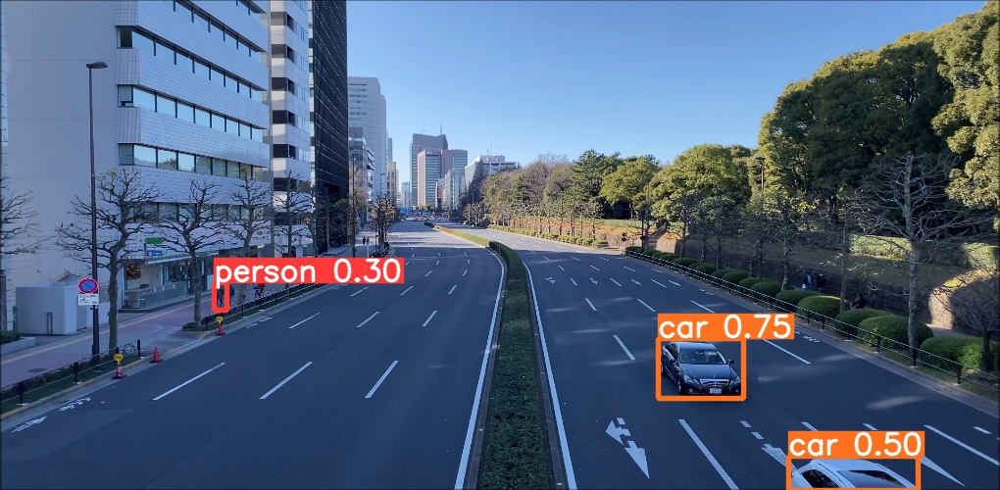

Vehicle Counting and Speed Estimation Using YOLOv8
=================================================

This project leverages the cutting-edge capabilities of YOLOv8 for real-time vehicle counting and speed estimation. It is designed to aid in traffic monitoring systems, enhancing road safety and traffic management.

## ⚠ Disclaimer
This tool is developed for educational and developmental purposes. It's crucial to understand the implications and responsibilities of using such technologies in real-world applications.

## Project Overview

*Example image showing detected vehicles and their tracking.*




## How to Use

1. **Prepare Your Environment**:
    Ensure you have Python, OpenCV, and the ultralytics YOLO library installed.

2. **Clone the Repository**:
    ```sh
    git clone https://github.com/yourgithub/vehicle-detection-yolov8.git
    ```

3. **Run the Detection**:
    Navigate to the cloned directory and run:
    ```sh
    python main.py
    ```

## Detailed System Workflow

### Initialization and Configuration
- **Model Initialization**: Utilizes the YOLOv8s model for object detection, loaded from a pretrained model file `yolov8s.pt`.
- **Video Capture**: Captures video feed from a file `vid2.mp4`.
- **Object Classes**: Reads the classes of detectable objects like motorcycles, cars, etc., from `coco.txt`.

### Tracking Mechanism
- **Tracking Logic**: Employs a custom tracking system using the `Tracker` class to follow detected objects across frames, managing their unique IDs.
- **Updating Records**: The tracker calculates the Euclidean distance between new and existing center points of objects, reassigning IDs based on proximity within a threshold.

### Detection and Counting
- **Frame Processing**: Each video frame is processed in sequence, resized for consistency.
- **Object Detection**: YOLOv8 predicts and identifies objects within each frame, annotating them with bounding boxes.
- **Object Filtering and Counting**: Filters specific vehicle types and counts motorcycles as they cross a predefined line, displaying the count on-screen.

### Interaction and UI
- **Color Picker**: An RGB color picker activates upon mouse movement over the video, displaying RGB values at the cursor location.
- **Display Updates**: The interface continuously updates with the video feed, showing detected vehicles and the motorcycle count.

### User Interface
- **Video Display**: The "RGB" window shows the live video feed with overlays like bounding boxes and counts.
- **Control**: Allows step-by-step video progression or pausing through key presses, useful for detailed analysis.

## Customizations

You can adjust several parameters including the video source file, the sensitivity of the detection, and the specifics of the tracking algorithm.

For example, to change the video source:
```sh
python main.py --video_path=new_video.mp4
```

## System Requirements
- **Python 3.x**
- **OpenCV library**
- **Ultralytics**
- **YOLO library**

## Troubleshooting
No detections in the video
Ensure your model file is correctly loaded and the video file path is correct. Check if the video has clear visibility and minimal occlusions.

## Tracking issues
Adjust the tracking parameters if the vehicles are not being consistently followed across frames.

## Performance is slow
Try reducing the video resolution or using a more powerful GPU. YOLOv8 is resource-intensive.

## Still need help?
Open an issue on our GitHub repository, and we will help you as soon as possible.

Enjoy exploring and extending this project! Feel free to contribute and suggest improvements.
